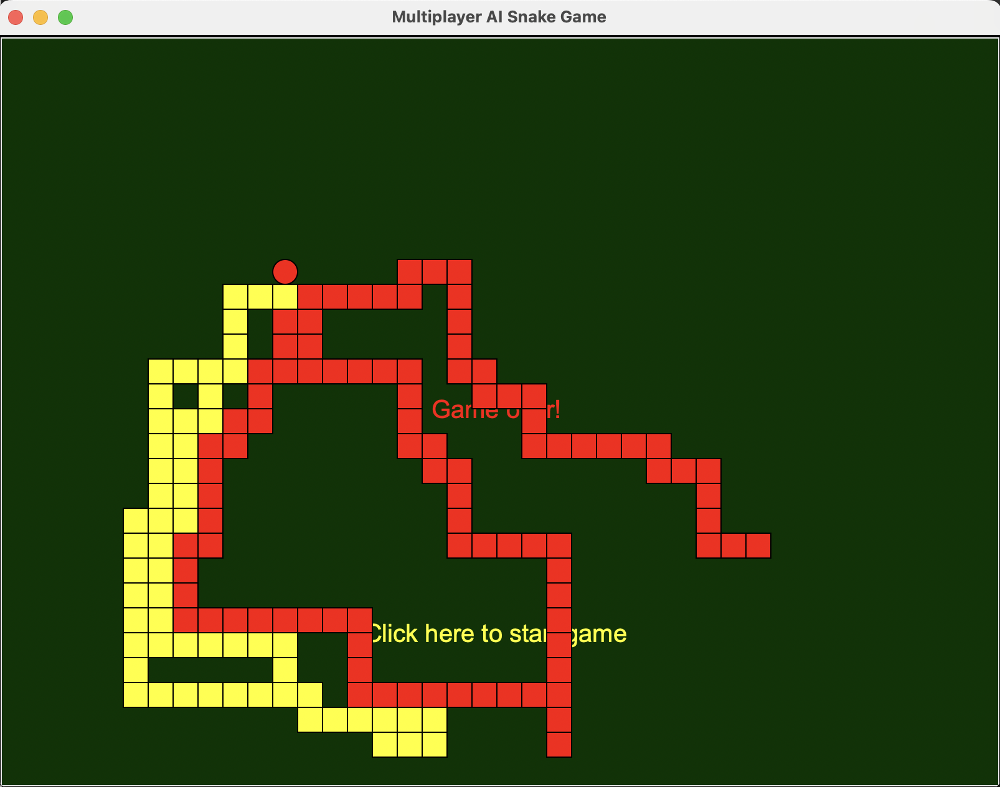

# 🐍 Multiplayer AI Snake Game

A competitive snake game where two AI-controlled snakes battle for survival using TCP socket networking.



## 📋 Overview

This project implements a multiplayer version of the classic Snake game where two snakes (red and yellow) compete against each other on a grid. Each snake can be controlled by a separate server running custom AI logic over TCP/IP, allowing for strategic battles between different AI implementations.

## ✨ Features

### 🎮 Game Mechanics
* **Two Snakes**: Red and yellow snakes compete on the same grid
* **Apple Collection**: Snakes grow longer by eating apples that appear randomly
* **Immunity System**: Eating an apple grants temporary immunity from opponent's poison
* **Victory Condition**: Force your opponent to collide with your snake's body or a wall
* **Network Architecture**: TCP socket communication allows for distributed gameplay

### 🎯 Multiple Game Modes
* **Single Player Mode**: Control a snake using keyboard inputs (Up/Down/Left/Right)
* **Local AI Simulation**: Watch two AI-controlled snakes battle on your local machine
* **Network Battle Mode**: Pit two AI servers against each other over TCP sockets

## 🛠️ Technologies Used

### Backend


### Frontend


### Version Control


<!-- ## 📸 Screenshots


Add more screenshots here -->

## 🚀 Getting Started

### ✅ Prerequisites
* Python 3.6+
* Jupyter Notebook
* Required Python packages:
  ```
  pip install keepalive-socket
  ```

### 🔧 Installation

```bash
# Clone the repository
git clone https://github.com/yourusername/Multiplayer-AI-Snake-Game.git
cd multiplayer-ai-snake
```

### ▶️ Running the Game

1. **Start the snake servers** on localhost or remote machines:

```bash
python yss.py  # Yellow snake server on port 5001
python rss.py  # Red snake server on port 5002
```

2. **Run the main game**:

```bash
jupyter notebook snake-game.ipynb
```

3. Restart Kernel and run all cells in the notebook
4. Click "Click here to start game" in the game window

## 📁 Project Structure

```
multiplayer-ai-snake-game/
├── snake-game.ipynb           # Main game implementation
├── yss.py                      # Yellow snake server implementation
├── rss.py                      # Red snake server implementation
├── assets/                     # Images and static assets
└── Alternative-Implementations/# Directory for experimental approaches
    ├── flask-server/           # Flask-based HTTP servers
    ├── test-servers/           # Test server implementations
    └── game-code/              # Extracted game code
```

## 🧭 Game Parameters

At the start of each game, these parameters are set:
* `snake_immunity_period`: How many game heartbeats snakes gain immunity after eating an apple (1-6)
* `game_period`: How many game heartbeats before snake servers are queried for direction changes (1-6)

## 💻 Developing Your Own Snake AI

The yellow (`yss.py`) and red (`rss.py`) snake servers contain the AI logic that controls each snake. You can modify this code to implement your own strategy:

### AI Communication Protocol
1. Each server receives the game state as a string containing:
   * Coordinates of both snakes (head positions)
   * Position of the apple
2. The server must respond with one of these direction commands:
   * "Up"
   * "Down"
   * "Left"
   * "Right"
   * "Straight" (continue in current direction)
3. Responses must be sent within 1 second, or the snake loses

## 🎯 Game Tactics

### 🗡️ Offensive Strategies
* Encircle your opponent to limit their movement options
* Cut off your opponent's path to the apple
* Use your immunity period to attack aggressively
* Target opponent directly when immune using A* pathfinding

### 🛡️ Defensive Strategies
* Stay close to the walls when not immune
* Keep track of the opponent's immunity status
* Maintain distance from the opponent's head
* Track opponent's body positions to avoid collisions
* Detect and break oscillation patterns when stuck

## 🧠 Current Implementation

The snake server implementations utilize several algorithms and techniques:

* **A\* Search Algorithm**: Efficiently finds the shortest path to targets (apple) while avoiding obstacles (opponent)
* **Manhattan Distance**: Calculates distances between positions on the grid 
* **Opponent Body Tracking**: Maintains a history of opponent positions to avoid collisions
* **Oscillation Detection**: Identifies and breaks movement patterns that cause the snake to get stuck
* **Edge Proximity Detection**: Prevents the snake from getting trapped against walls 
* **Immunity-based Strategy Switching**: Changes between defensive and offensive behaviors 
* **Safety Checking**: Validates moves to prevent collisions with walls or opponent 
* **TCP Socket Communication**: Handles real-time data exchange with the game server

## 🤝 Contributing

Contributions are welcome! Please feel free to fork the repo, make changes, and submit a Pull Request.

## ✍️ Author

* Tanmay Chandan
* Parnesh Adawadkar 

## 📜 Acknowledgments

This project was developed as part of the Program Structures and Algorithms course at Northeastern University.

---

⭐ Star this repo if you found it useful!